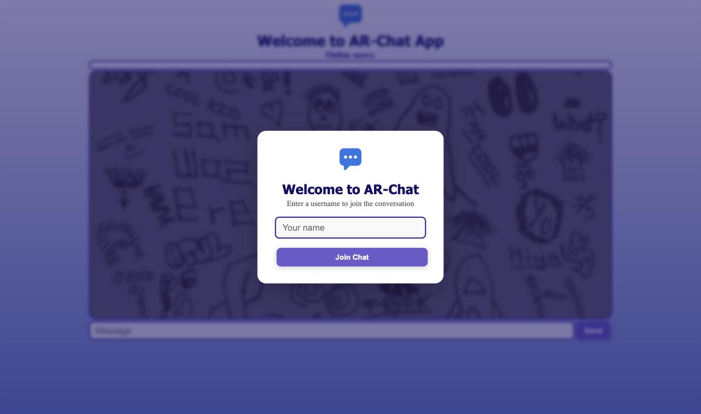
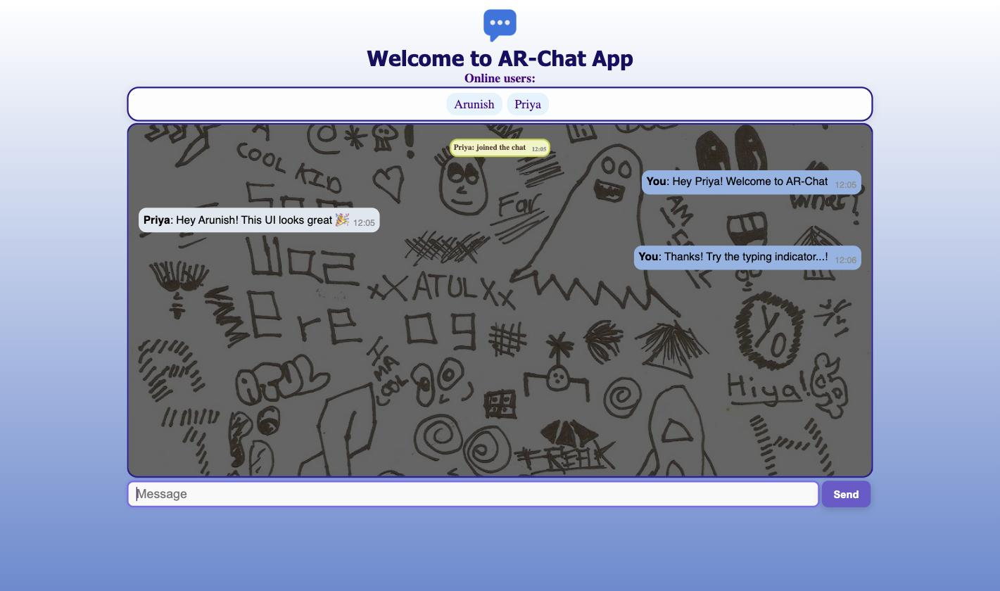
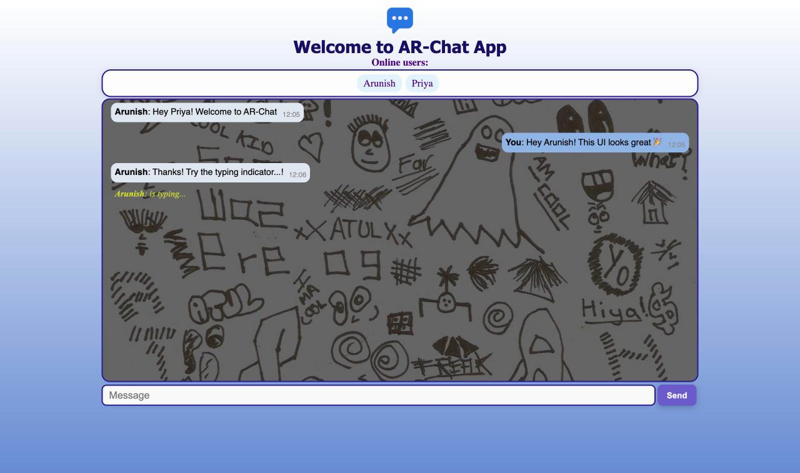

<div align="center">
  

  # AR Chat App

  A real-time chat application built with **Socket.IO** and plain JavaScript — no frontend framework, no build step, just a fast WebSocket chat room.

  [**Live Demo**](https://ar-chat-app.vercel.app/) · [Report a Bug](https://github.com/arunishrajput/ar-chat-app/issues) · [Request a Feature](https://github.com/arunishrajput/ar-chat-app/issues)

  
  
  
  
</div>

## Preview

| Join the chat | Conversation | Typing indicator |
| :---: | :---: | :---: |
|  |  |  |

## Features

- **Real-time messaging** powered by Socket.IO
- **Custom usernames** — pick a name via a lightweight in-page modal when you join
- **Online users list** that updates live as people join and leave
- **"is typing..." indicator** so you can see when someone's composing a message
- **Timestamped messages** for context
- **Audio cues** for joins, leaves, sent messages, and received messages
- **Responsive layout** that adapts to mobile screens

## Tech Stack

| Layer | Tech |
| --- | --- |
| Frontend | HTML5, CSS3, vanilla JavaScript, [Socket.IO client](https://socket.io/) |
| Backend | [Node.js](https://nodejs.org/), [Socket.IO server](https://socket.io/), [dotenv](https://www.npmjs.com/package/dotenv) |
| Hosting | Frontend on [Vercel](https://vercel.com/), backend on [Render](https://render.com/) |

## Project Structure

```
ar-chat-app/
├── frontend/
│   ├── assets/            # Logo, sound effects, screenshots
│   ├── css/                # Styles + chat background
│   ├── js/client.js        # All client-side Socket.IO logic
│   └── index.html
└── nodeServer/
    ├── index.js             # Socket.IO server + CORS + presence/typing events
    ├── package.json
    └── .env.example         # Template for required environment variables
```

## Getting Started

### Prerequisites

- [Node.js](https://nodejs.org/) v14 or later
- A modern web browser

### 1. Clone the repository

```bash
git clone https://github.com/arunishrajput/ar-chat-app.git
cd ar-chat-app
```

### 2. Run the backend

The Socket.IO server lives in `nodeServer/`.

```bash
cd nodeServer
npm install
cp .env.example .env
```

Edit `.env` and set the port you want the server to run on, plus every origin you'll be serving the frontend from (see [Environment Variables](#environment-variables)):

```bash
PORT=8000
CLIENT_1_URL=http://127.0.0.1:5500
```

Start it:

```bash
npm start
```

You should see `Backend running on: 8000` (or whichever port you chose).

### 3. Point the frontend at your backend

By default, `frontend/index.html` and `frontend/js/client.js` are wired to the deployed backend at `https://ar-chat-app-h1pj.onrender.com/`. If you're running your own server, update the socket URL in **both** places to match the `PORT` from step 2:

**`frontend/js/client.js`**

```js
const socket = io("http://localhost:8000/"); // SOCKET SERVER URL
```

**`frontend/index.html`**

```html
<script defer src="http://localhost:8000/socket.io/socket.io.js"></script> <!-- SOCKET SERVER URL -->
```

### 4. Serve the frontend

`frontend/index.html` needs to be served over HTTP (not opened directly as a `file://` URL) so the Socket.IO CORS check passes. Any static server works, for example:

```bash
cd frontend
npx serve .
# or: python3 -m http.server 5500
```

Then open the printed URL in your browser — make sure it matches one of the `CLIENT_*_URL` values in your `.env`.

## Environment Variables

Set these in `nodeServer/.env` (see `nodeServer/.env.example`):

| Variable | Description |
| --- | --- |
| `PORT` | Port the Socket.IO server listens on |
| `CLIENT_1_URL` | An allowed frontend origin for CORS |
| `CLIENT_2_URL` | Another allowed frontend origin (optional) |
| `CLIENT_3_URL` | Another allowed frontend origin (optional) |

## Usage

1. Open the chat app in your browser.
2. Enter a username in the join modal and click **Join Chat**.
3. Start chatting — messages, joins/leaves, and typing status are broadcast to everyone connected.

## Contributing

Contributions are welcome! Fork the repo, create a feature branch, and open a pull request. For larger changes, please open an issue first to discuss what you'd like to change.

## Acknowledgments

- [Socket.IO](https://socket.io/)
- [Node.js](https://nodejs.org/)
